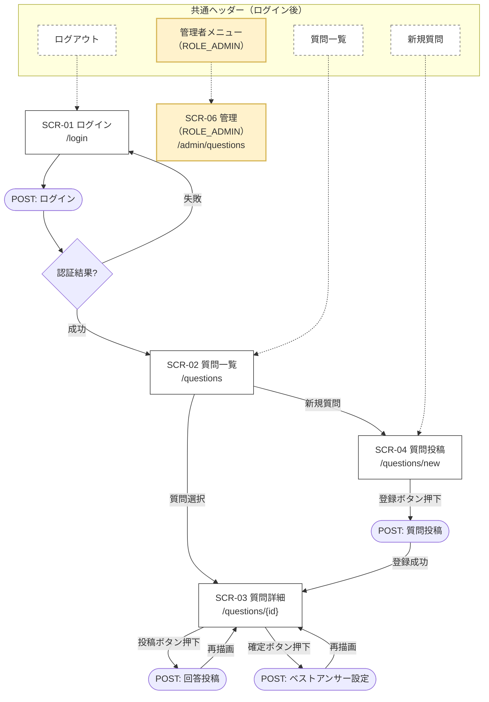
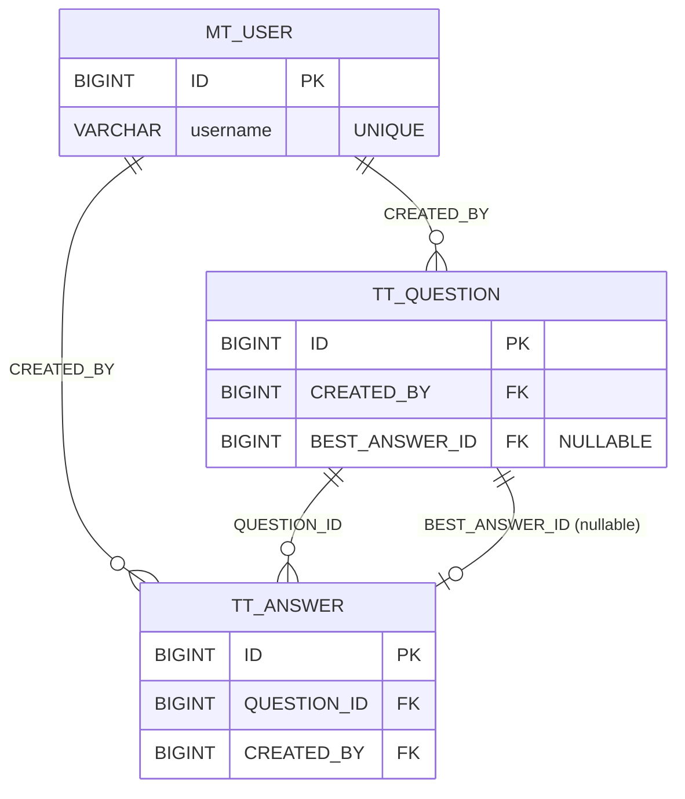

# 基本設計書

## 社内ナレッジ共有・Q&A管理システム

---

## 1. 目的・概要

### 1.1 目的

社内の問い合わせをQ&Aとして蓄積し、再利用可能なナレッジとして一元管理することで、問い合わせ対応の属人化防止と業務効率化を図る。

### 1.2 システム概要

* 社内向け Webアプリケーション
* 技術スタック：Spring Boot / Thymeleaf / Spring Security / RDB（PostgreSQL想定）
* 認証必須（ログイン後に機能利用）
* 質問・回答・ベストアンサー・ステータス管理・検索/絞り込みを提供

### 1.3 対象ユーザー

* 一般ユーザー：質問/回答の投稿、参照
* 管理者：質問のステータス変更・管理、必要に応じた編集

---

## 2. 画面設計（画面一覧・遷移・入出力）

### 2.1 画面一覧

| 画面ID   | 画面名       | URL                       | 概要                       |
|--------|-----------|---------------------------|--------------------------|
| SCR-01 | ログイン      | `/login`                  | 認証                       |
| SCR-02 | 質問一覧      | `/questions`              | 一覧表示、検索、絞り込み             |
| SCR-03 | 質問詳細      | `/questions/{id}`         | 質問本文・回答一覧、回答投稿、ベストアンサー表示 |
| SCR-04 | 質問投稿      | `/questions/new`          | 質問作成                     |
| SCR-05 | 回答投稿（詳細内） | `/questions/{id}/answers` | 質問に回答（POST）              |
| SCR-06 | 管理（質問管理）  | `/admin/questions`        | 管理者向け一覧、ステータス変更等         |

### 2.2 画面遷移図

### 2.3 画面項目定義（主要のみ）

#### SCR-01 ログイン

| 項目       | 名称     | 必須 | 型   | 備考     |
|----------|--------|---:|-----|--------|
| username | ユーザーID |  ○ | 文字列 | ログインID |
| password | パスワード  |  ○ | 文字列 | マスク表示  |

#### SCR-02 質問一覧

| 区分   | 項目        | 備考                 |
|------|-----------|--------------------|
| 検索条件 | キーワード     | タイトル部分一致           |
| 検索条件 | ステータス     | 未回答/回答済み/クローズ      |
| 一覧   | タイトル      | クリックで詳細へ           |
| 一覧   | ステータス     | 表示                 |
| 一覧   | 回答数       | 表示                 |
| 一覧   | 作成日時/更新日時 | 表示（新着順は作成日時DESC想定） |
| 操作   | 新規質問      | 質問投稿画面へ            |

#### SCR-03 質問詳細

| 区分 | 項目        | 備考                       |
|----|-----------|--------------------------|
| 表示 | タイトル/本文   | クローズ時は編集不可               |
| 表示 | ステータス     | バッジ表示                    |
| 表示 | ベストアンサー   | 設定時に強調表示                 |
| 表示 | 回答一覧      | 作成日時昇順 or 降順（基本設計では昇順推奨） |
| 入力 | 回答本文      | クローズ時は投稿不可               |
| 操作 | 回答投稿      | POST                     |
| 操作 | ベストアンサー設定 | 質問の回答に対して1件のみ（権限・ルールあり）  |

#### SCR-04 質問投稿

| 項目   | 必須 | 型        | ルール    |
|------|---:|----------|--------|
| タイトル |  ○ | 1〜100文字  | 空白のみ不可 |
| 本文   |  ○ | 1〜4000文字 | 空白のみ不可 |

#### SCR-06 管理（質問管理）

| 区分 | 項目      | 備考              |
|----|---------|-----------------|
| 一覧 | 質問一覧    | ステータス・回答数等      |
| 操作 | ステータス変更 | 管理者のみ、クローズ等     |
| 操作 | 内容編集    | 必要なら（投稿者/管理者のみ） |

---

## 3. 機能設計（機能一覧と仕様）

### 3.1 認証・認可

* Spring Security によるフォームログイン
* ロール：

    * `ROLE_USER`
    * `ROLE_ADMIN`

**アクセス制御（概要）**

| 機能        |           USER |      ADMIN |
|-----------|---------------:|-----------:|
| 閲覧（質問/回答） |              ○ |          ○ |
| 質問投稿      |              ○ |          ○ |
| 回答投稿      |     ○（※クローズ除く） | ○（※クローズ除く） |
| ベストアンサー設定 |    ○（※質問者本人のみ） |          ○ |
| 質問ステータス変更 |              × |          ○ |
| 回答編集      |          投稿者のみ |          ○ |
| 質問編集      | 投稿者のみ（※クローズ除く） | ○（※クローズ除く） |

### 3.2 質問一覧（検索・絞り込み）

* キーワード：質問タイトルの部分一致（LIKE `%keyword%`）
* ステータス：完全一致
* 表示順：新着順（作成日時 DESC）
* ページング：基本設計では「将来対応」として注記（件数少数想定でもOK）

### 3.3 質問詳細

* 質問本文・回答一覧を表示
* 回答が0件ならステータス「未回答」、1件以上で「回答済み」
* ベストアンサー設定済みならステータス「クローズ」

### 3.4 質問投稿

* 登録直後はステータス「未回答」
* 監査情報（作成者/作成日時）を保持

### 3.5 回答投稿

* クローズ済み質問には投稿不可
* 投稿成功後、質問ステータスを「回答済み」へ更新（未回答→回答済み）

### 3.6 ベストアンサー設定

* 1質問につき1回答のみ設定可
* ベストアンサー設定後：

    * 質問ステータスを「クローズ」へ
    * 以降、質問編集不可・回答追加不可

### 3.7 ステータス管理（管理者）

* 管理者のみ、質問ステータスを変更可能
* ただし、整合性を担保するため制約を設ける（例）

    * クローズ→未回答 などの戻しは原則不可（必要なら運用ルールとして“可能/不可”を決める）

---

## 4. 業務ルール（システム担保）

| ルールID | ルール                 | 担保方法                     |
|-------|---------------------|--------------------------|
| BR-01 | クローズ質問は編集不可         | Serviceでチェック + 400/業務エラー |
| BR-02 | クローズ質問に新規回答不可       | 同上                       |
| BR-03 | ベストアンサーは1件のみ        | DB制約 + Serviceチェック       |
| BR-04 | ベストアンサー設定後、質問をクローズへ | トランザクション内で更新             |
| BR-05 | 質問ステータス変更は管理者のみ     | 認可（@PreAuthorize等）       |
| BR-06 | 回答編集は投稿者または管理者のみ    | 認可 + Service所有者チェック      |

---

## 5. データ設計（ERレベル）

### 5.1 エンティティ一覧

| エンティティ      | 概要      |
|-------------|---------|
| MT_USER     | ユーザーマスタ |
| TT_QUESTION | 質問管理データ |
| TT_ANSWER   | 回答管理データ |

### 5.2 ER図

### 5.3 テーブル定義（案）

#### MT_USER

| カラム           | 型            | PK | NN | 備考         |
|---------------|--------------|---:|---:|------------|
| ID            | BIGINT       |  ○ |  ○ | SEQUENCE   |
| USERNAME      | VARCHAR(64)  |    |  ○ | UNIQUE     |
| PASSWORD_HASH | VARCHAR(255) |    |  ○ | BCRYPT     |
| ROLE          | VARCHAR(32)  |    |  ○ | USER/ADMIN |
| CREATED_AT    | TIMESTAMP    |    |  ○ |            |
| UPDATED_AT    | TIMESTAMP    |    |  ○ |            |

#### TT_QUESTION

| カラム            | 型            | PK | NN | 備考                         |
|----------------|--------------|---:|---:|----------------------------|
| ID             | BIGINT       |  ○ |  ○ |                            |
| TITLE          | VARCHAR(100) |    |  ○ |                            |
| BODY           | TEXT         |    |  ○ |                            |
| STATUS         | VARCHAR(16)  |    |  ○ | UNANSWERED/ANSWERED/CLOSED |
| CREATED_BY     | BIGINT       |    |  ○ | FK → MT_USER.ID            |
| BEST_ANSWER_ID | BIGINT       |    |    | FK → TT_ANSWER.ID          |
| CREATED_AT     | TIMESTAMP    |    |  ○ |                            |
| UPDATED_AT     | TIMESTAMP    |    |  ○ |                            |

#### TT_ANSWER

| カラム         | 型         | PK | NN | 備考                  |
|-------------|-----------|---:|---:|---------------------|
| ID          | BIGINT    |  ○ |  ○ |                     |
| QUESTION_ID | BIGINT    |    |  ○ | FK → TT_QUESTION.ID |
| BODY        | TEXT      |    |  ○ |                     |
| CREATED_BY  | BIGINT    |    |  ○ | FK → MT_USER.ID     |
| CREATED_AT  | TIMESTAMP |    |  ○ |                     |
| UPDATED_AT  | TIMESTAMP |    |  ○ |                     |

**その他の制約**

* `TT_ANSWER.QUESTION_ID` INDEX
* `TT_QUESTION.STATUS` INDEX（絞り込み用）
* `TT_QUESTION.CREATED_AT` INDEX（新着順）

---

## 6. API/URL設計（Controller単位のIF）

| 機能        | Method | URL                            | 説明              |
|-----------|--------|--------------------------------|-----------------|
| ログイン画面    | GET    | `/login`                       | 画面表示            |
| ログイン      | POST   | `/authenticate`                | Spring Security |
| 質問一覧      | GET    | `/questions`                   | 検索/絞り込み         |
| 質問詳細      | GET    | `/questions/{id}`              | 詳細表示            |
| 質問投稿画面    | GET    | `/questions/new`               | 入力画面            |
| 質問登録      | POST   | `/questions`                   | 作成              |
| 回答登録      | POST   | `/questions/{id}/answers`      | 回答              |
| ベストアンサー設定 | POST   | `/questions/{id}/best-answer`  | answerId指定      |
| 管理画面      | GET    | `/admin/questions`             | 管理者一覧           |
| ステータス変更   | POST   | `/admin/questions/{id}/status` | 管理者のみ           |

**リクエスト例**

* ベストアンサー設定：`answerId` を form パラメータで送信
* ステータス変更：`status` を送信（CLOSED等）

---

## 7. 入力チェック（バリデーション）

### 7.1 共通方針

* Controller：Bean Validation（@NotBlank, @Size）
* Service：業務ルール（クローズ不可など）をチェック

### 7.2 主要項目

* 質問タイトル：必須、1〜100
* 質問本文：必須、1〜4000
* 回答本文：必須、1〜4000
* ステータス：列挙型のみ許容

---

## 8. 例外・エラーハンドリング

### 8.1 例外分類

* 業務例外：ルール違反（クローズ質問への回答など）
* システム例外：DB障害、予期せぬNPE等

### 8.2 表示方針

* 業務例外：同画面にエラーメッセージ表示（400相当）
* 認可エラー：403画面 or 共通エラーページ
* システム例外：500画面（共通エラーページ、ログに詳細）

---

## 9. 非機能設計（基本設計としての方針）

* セキュリティ：パスワードBCrypt、CSRF有効、入力値サニタイズ（Thymeleaf標準のエスケープ）
* ログ：重要操作（質問作成/回答作成/ベストアンサー/ステータス変更）をINFOで記録
* 同時アクセス：少数想定、チューニングは過剰にしない
* テスト：Service層の業務ルールを中心にユニットテスト（Junit）
* 監査：created_by / created_at / updated_at を保持

